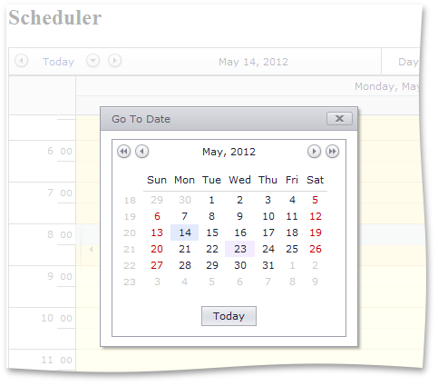

<!-- default badges list -->

[](https://supportcenter.devexpress.com/ticket/details/E4015)
[](https://docs.devexpress.com/GeneralInformation/403183)
<!-- default badges end -->

# Scheduler for ASP.NET NVC - How to customize the Go to Date dialog

This example demonstrates how to implement a custom **Go to Date** dialog.



## Implementation Details

1. Call the [SetGotoDateFormTemplateContent](https://docs.devexpress.com/AspNetMvc/DevExpress.Web.Mvc.MVCxSchedulerOptionsForms.SetGotoDateFormTemplateContent(System.Action-DevExpress.Web.ASPxScheduler.GotoDateFormTemplateContainer-)) method to specify a custom content for the **Go to Date** form. Add a single [Calendar](https://docs.devexpress.com/AspNetMvc/8981/components/data-editors-extensions/calendar) extension to the form. 

    ```csharp
    settings.OptionsForms.SetGotoDateFormTemplateContent(c => {
        Html.DevExpress().Calendar(calendarSettings => {
            calendarSettings.Name = "calendar";
            calendarSettings.Properties.ClientSideEvents.SelectionChanged = "OnCalendarSelectionChanged";
            calendarSettings.Properties.ShowClearButton = false;
        }).Bind(c.Date).Render();
    });
    ```

2. Specify the [CalendarClientSideEvents.SelectionChanged](https://docs.devexpress.com/AspNet/DevExpress.Web.CalendarClientSideEvents.SelectionChanged) property to subscribe to selection changing in the calendar. The event handler calls the [ASPxClientScheduler.GoToDateFormApply](https://docs.devexpress.com/AspNet/js-ASPxClientScheduler.GoToDateFormApply) method to initiate a callback to the server.

    ```jscript
    function OnCalendarSelectionChanged(s, e){
        gotoDateCallback = true;
        scheduler.GoToDateFormApply();
    }
    ```

3. Handle the [MVCxSchedulerClientSideEvents.BeginCallback](https://docs.devexpress.com/AspNet/DevExpress.Web.CallbackClientSideEventsBase.BeginCallback) event to obtain a new date from the calendar and pass it to the server.

    ```jscript
    function OnSchedulerBeginCallback(s, e){
        if(gotoDateCallback){
            e.customArgs["NewDate"] = calendar.GetValueString();
            gotoDateCallback = false;
        }
    }
    ```

4. Implement a special [callback command](https://docs.devexpress.com/AspNet/5462/components/scheduler/concepts/callback-commands) to handle this request properly. Create a `DevExpress.Web.ASPxScheduler.Internal.GotoDateFormCallbackCommand` class successor and override its `ParseParameters` and `ExecuteCore` methods. In the `ExecuteCore` method, call methods of the [IDateTimeNavigationService](https://docs.devexpress.com/CoreLibraries/DevExpress.XtraScheduler.Services.IDateTimeNavigationService) interface to perform date navigation in the scheduler.
  
    ```csharp
    public class MVCxSchedulerGotoDateFormCallbackCommand: GotoDateFormCallbackCommand {
        public MVCxSchedulerGotoDateFormCallbackCommand(MVCxScheduler control)
            : base(control) {
        }
        public new DateTime NewDate { get; protected set; }
        protected override void ParseParameters(string parameters) {
            string rawDate = HttpContext.Current.Request["NewDate"];
            NewDate = DateTime.Parse(rawDate);
        }
        protected override void ExecuteCore() {
            IDateTimeNavigationService service = (IDateTimeNavigationService)Control.GetService(typeof(IDateTimeNavigationService));
            if (service != null)
                service.GoToDate(NewDate);
        }
    }
    ```

5. Create a delegate method for the [SchedulerSettings.BeforeExecuteCallback](https://docs.devexpress.com/AspNetMvc/DevExpress.Web.Mvc.SchedulerSettings.BeforeExecuteCallbackCommand) property to execute your custom command instead of the default command when the `GotoDateForm` command is queried for execution.

    ```csharp
    settings.BeforeExecuteCallbackCommand = (sender, e) => {
        if(e.CommandId == SchedulerCallbackCommandId.GotoDateForm)
            e.Command = new MVCxSchedulerGotoDateFormCallbackCommand((MVCxScheduler)sender);
    };
    ```

## Files to Review

* [SchedulingDataClasses.cs](./CS/Scheduler.CustomizationGotoDateForm/Models/SchedulingDataClasses.cs)
* [Scheduler.cshtml](./CS/Scheduler.CustomizationGotoDateForm/Views/Scheduler/Scheduler.cshtml)
* [SchedulerPartial.cshtml](./CS/Scheduler.CustomizationGotoDateForm/Views/Scheduler/SchedulerPartial.cshtml)
